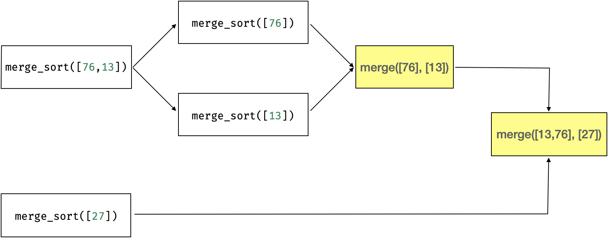

[TOC]

## 递归实现

主体框架是基于递归实现。

### Python

鉴于 Python 对数组（列表）操作的强大支持，可以使用Python快速实现二路归并排序原型。
具体参考《图解LeetCode初级算法（Python版）》给出的示例代码。

1. 设定递归基为len(A)=1，即单元素有序，无需切分归并，递归退出。
2. 对于两个以上元素，计算中点切分成两部分，对每部分递归归并，最后再对初始两路归并合龙。

```Python
def merge_sort(A: list) -> list:
    # base case: 只有一个元素或为空
    nLen = len(A)
    if nLen <= 1:
        return A
    mid = (nLen-1) // 2
    # left, right = A[:mid+1], A[mid+1:]
    # return merge(merge_sort(left), merge_sort(right))
    left = merge_sort(A[:mid+1])
    right = merge_sort(A[mid+1:])
    return merge(left, right)
```

在 merge 中，每次总是选择二路头部最小值，追加到有序序列。
借助 Python List 的 pop 接口，每次调用 pop(0) 弹出头部小值。

### C实现

C语言中没有便捷的数组对象化操作，因此需要明确传入数组索引区间。

```C
// 对数组 A[l:h] 进行归并排序
void mergeSort(int *array, const int low, const int high) {
    // base case: 只有一个元素，直接返回。
    if (low >= high)
        return;
    int mid = (low+high)/2; // median
    mergeSort(array, low, mid); // left-half
    mergeSort(array, mid+1, high); // right-half
    merge(array, low, mid, high); // merge [low, mid] and [mid+1, high] in place
}
```

`mergeSortedArrays` 输入两个有序数组，这里的 `merge` 则是对一个数组的两部分进行原址合并（In-place Merge）。

- 左半部分为 a1[low:mid], 右半部分为 a2[mid+1:high]。

在 merge 中动态分配一个等容量的辅助数组temp，先将array待排slice复制到temp中，然后基于temp的两部分进行归并，array则用来存储归并结果。

- **注意**：array的索引范围为 [low,high]，temp的索引相对array偏移low，其索引范围为 [0, high-low-1]。

随着算法的执行，将数据项从temp两部分归并到array中，最终使得array整体变得有序，实现就地排序。

### 递归流程

让我们以案例演绎中右1/2为例，来看看两层嵌套调用的压栈、出栈机制流程。

传入 A[4:7]={76,13,27}，不满足递归基，计算中点分割成两部分，继续递归调用。

从整体上看，是这样的：

```Python
# round 1
left=merge_sort([76,13])
right=merge_sort([27])
merge(left, right)
```

但实际上，left=merge_sort([76,13]) 不会立即返回，而是继续分化成以下调用：

```Python
# round 2: expand left=merge_sort([76,13]) of round 1
left=merge_sort([76])
right=merge_sort([13])
merge(left, right)
```

以上两个merge_sort抵达递归基，直接返回单元素（列表），经过merge返回 [13,76]。
即 round 1中的left返回 [13,76]，right抵达递归基返回单元素（列表）[27]。
再调用merge，返回二路归并结果 [13,27,76]。



## 非递归实现

### C

i=1 表示二路单元素归并；i=2表示二路双元素归并；i=4表示二路长度为4的有序列表归并：

- len=2，i取值为[1]；
- len=3/4，i取值为[1,2]；
- len=5/6/7/8，i取值为[1,2,4]；
- len=9/10/11/12/13/14/15/16，i取值为[1,2,4,8]

如果len=5/6/7/8，i=1,2,4：

- len=5/6，pair=3,1，最后补充一轮
- len=7/8，pair=4,2,1
- len=9，pair=5,2,1，最后补充一轮

重点是：（1）根据归并单元长度i计算要归并的路数pair；（2）循环pair，根据间隔i计算每对k要归并的范围。

对于k从0算起，当k=1时，前面已经比较过一对；当k=2时，前面已经比较过两对，...。
当前归并单元长度为i，二路归并长度为2*i。
第k对的起始索引为 l=`k*(2*i)`，二路归并 [`k*(2*i)`, `k*(2*i)+i-1`] 和 [`k*(2*i)+i`, `k*(2*i)+i+i-1`]。
即 h = `k*(2*i)+2*i-1` = `(k+1)*(2*i)-1`。

```C
void mergeSortBisect(int *array, const int low, const int high) {
    // base case: 只有一个元素，直接返回。
    if (low >= high)
        return;
    int len = high-low+1;
    // 归并单元长度：i=1,2,4,...
    for (int i=1; i<len; i*=2) {
        // 归并对数
        int pair = (len+1)/(2*i);
        if (pair > 0) {
            printf("--------------------\n");
            printf("i=%d, pair=%d\n", i, pair);
            // 逐对归并
            int l = 0, h = 0;
            for (int k=0; k<pair; k++) {
                l=k*i*2;
                h=(k+1)*i*2-1;
                if (h > len-1)
                    h = len-1; // 修正右边最大索引
                int m=(l+h)/2;
                printf("k=%d, [l,m,h] = %d,%d,%d\n", k, l, m, h);
                merge(array, l, m, h); // 二路归并：[l,m], [m+1, h]
            }
            // 尾部落单，补充归并
            if (h<len-1) {
                printf("complement [l,m,h] = %d,%d,%d\n", l, h, len-1);
                merge(array, l, h, len-1); // 补充归并：[l,h], [h, len-1]
            }
        }
    }
}
```

#### 非递归流程

以下是输入 A2[6] = {38, 27, 43, 3, 9, 82} 的运行日志：

```
A2 = {38, 27, 43, 3, 9, 82}
--------------------
i=1, pair=3
k=0, [l,m,h] = 0,0,1
a1=[0:0] = {38}
a2=[1:1] = {27}
    merged=[0:1] = {27, 38}
k=1, [l,m,h] = 2,2,3
a1=[2:2] = {43}
a2=[3:3] = {3}
    merged=[2:3] = {3, 43}
k=2, [l,m,h] = 4,4,5
a1=[4:4] = {9}
a2=[5:5] = {82}
    merged=[4:5] = {9, 82}
--------------------
i=2, pair=1
k=0, [l,m,h] = 0,1,3
a1=[0:1] = {27, 38}
a2=[2:3] = {3, 43}
    merged=[0:3] = {3, 27, 38, 43}
complement [l,m,h] = 0,3,5
a1=[0:3] = {3, 27, 38, 43}
a2=[4:5] = {9, 82}
    merged=[0:5] = {3, 9, 27, 38, 43, 82}
sorted A2 = {3, 9, 27, 38, 43, 82}
----------------------------------------
```

以下是输入 A2[7] = {38, 27, 43, 3, 9, 82, 10} 的运行日志：

```
A2 = {38, 27, 43, 3, 9, 82, 10}
--------------------
i=1, pair=4
k=0, [l,m,h] = 0,0,1
a1=[0:0] = {38}
a2=[1:1] = {27}
    merged=[0:1] = {27, 38}
k=1, [l,m,h] = 2,2,3
a1=[2:2] = {43}
a2=[3:3] = {3}
    merged=[2:3] = {3, 43}
k=2, [l,m,h] = 4,4,5
a1=[4:4] = {9}
a2=[5:5] = {82}
    merged=[4:5] = {9, 82}
k=3, [l,m,h] = 6,6,6
--------------------
i=2, pair=2
k=0, [l,m,h] = 0,1,3
a1=[0:1] = {27, 38}
a2=[2:3] = {3, 43}
    merged=[0:3] = {3, 27, 38, 43}
k=1, [l,m,h] = 4,5,6
a1=[4:5] = {9, 82}
a2=[6:6] = {10}
    merged=[4:6] = {9, 10, 82}
--------------------
i=4, pair=1
k=0, [l,m,h] = 0,3,6
a1=[0:3] = {3, 27, 38, 43}
a2=[4:6] = {9, 10, 82}
    merged=[0:6] = {3, 9, 10, 27, 38, 43, 82}
sorted A2 = {3, 9, 10, 27, 38, 43, 82}
----------------------------------------
```

### Python

和快速排序一样，也可以用栈代替递归，用栈记录待归并的分区。
参考 Python 代码 merge_sort_stack，基于列表实现 Bottom-up implementation。

使用非递归实现，需要自底向上，“底”对应递归基，即可归并的最小单元；“上”对应最终两个1/2归并合龙的整体。

1. 划分N个最小独立单元（subLen=1）列表（subList），相邻二路归并，更新已归并切片。
2. 划分N/2个二倍单元（subLen=2）列表（subList），相邻二路归并，更新已归并切片。
3. 划分N/4个四倍单元（subLen=4）列表（subList），更新已归并切片。
4. ...
5. 当N/(2^m)=0，不能再划分，上一步已完成最后一轮1/2归并。

其他说明：

- `subLen`：初始为1，二倍幂次递增，直到无法再倍增。为主 while 循环控制变量。
- `subList`：对原列表按照步长subLen分区，以便相邻分区配对二路归并。
- `pair`：两两二路归并的分组数，for循环控制归并次数。
- `mLen`=2*subLen：两个单元二路归并后的长度。
- 本轮subList二路归并完，更新subLen=mLen。

```Python
def merge_sort_stack(A: list) -> list:
    nLen = len(A)
    subLen = 1          # 待归并的单元size:1,2,4,...
    subList = []        # 待归并的单元列表，单元长度为subLen
    mLen = 2*subLen     # 归并后长度=2*size：2,4,8,...
    pair = nLen // 2    # 待归并组数，可能落单无法配对

    while subLen*2 <= nLen+1:
        subList.clear()
        for i in range(0, nLen, subLen):
            subList.append(A[i:i+subLen]) # 切分单元
        pair = len(subList) // 2    # 待归并组数
        mLen = 2*subLen             # 归并后长度
        print("{}: {}; pair={}, mLen={}".format(subLen, subList, pair, mLen))
        for j in range(pair): # 相邻逐对二路归并
            m = merge(subList[2*j], subList[2*j+1])
            A[j*mLen:(j+1)*mLen] = m # 更新已归并切片
            print("    A[{}:{}]->{}".format(j*mLen, (j+1)*mLen, m))
        subLen = mLen # 待归并单元size倍增

    # 最后一轮组队落单部分，补充归并一次
    if pair*mLen < nLen:
        A = merge(A[:pair*mLen], A[pair*mLen:])
        print("    extra merge([:{}], [{}:])->{}".format(pair*mLen, pair*mLen, A))

    return A
```

#### 非递归流程

第一组测试数组：A = [38, 27, 43, 3, 9, 82]，长度nLen=6为偶数。

1. subLen=1时，划分为6个单元，二路归并使相邻三组(mLen=2)内部有序。
2. subLen=2时，划分为3个单元，每个单元包含2个有序元素。

    - 一对二路归并使相邻一组(mLen=4)内部有序，剩下1个单元。

3. while循环退出，额外补充一轮归并。

```Shell
A = [38, 27, 43, 3, 9, 82]
1: [[38], [27], [43], [3], [9], [82]]; pair=3, mLen=2
merge [38],[27] -> [27, 38]
    A[0:2]->[27, 38]
merge [43],[3] -> [3, 43]
    A[2:4]->[3, 43]
merge [9],[82] -> [9, 82]
    A[4:6]->[9, 82]
2: [[27, 38], [3, 43], [9, 82]]; pair=1, mLen=4
merge [27, 38],[3, 43] -> [3, 27, 38, 43]
    A[0:4]->[3, 27, 38, 43]
merge [3, 27, 38, 43],[9, 82] -> [3, 9, 27, 38, 43, 82]
    extra merge([:4], [4:])->[3, 9, 27, 38, 43, 82]
sorted A = [3, 9, 27, 38, 43, 82]
```

第二组测试数组：A = [38, 27, 43, 3, 9, 82, 10]，长度nLen=7为奇数。

1. subLen=1时，划分为7个单元，二路归并使相邻三组(mLen=2)内部有序，落单一个元素。
2. subLen=2时，划分为4个单元，每个单元包含2个有序元素。

    - 最后一个单元实际上是上一轮落单的，只有一个元素。
    - 两对二路归并使相邻二组(mLen=4)内部有序。

3. subLen=4时，划分为2个单元，每个单元包含4个有序元素。

    - 最后一个单元只不足4个元素，只有3个元素。
    - 一对1/2二路归并使整体归并有序。

4. subLen=4已经是最大粗分终极二路，while循环退出。

```Shell
A = [38, 27, 43, 3, 9, 82, 10]
1: [[38], [27], [43], [3], [9], [82], [10]]; pair=3, mLen=2
merge [38],[27] -> [27, 38]
    A[0:2]->[27, 38]
merge [43],[3] -> [3, 43]
    A[2:4]->[3, 43]
merge [9],[82] -> [9, 82]
    A[4:6]->[9, 82]
2: [[27, 38], [3, 43], [9, 82], [10]]; pair=2, mLen=4
merge [27, 38],[3, 43] -> [3, 27, 38, 43]
    A[0:4]->[3, 27, 38, 43]
merge [9, 82],[10] -> [9, 10, 82]
    A[4:8]->[9, 10, 82]
4: [[3, 27, 38, 43], [9, 10, 82]]; pair=1, mLen=8
merge [3, 27, 38, 43],[9, 10, 82] -> [3, 9, 10, 27, 38, 43, 82]
    A[0:8]->[3, 9, 10, 27, 38, 43, 82]
sorted A = [3, 9, 10, 27, 38, 43, 82]
```

第三组测试数组：A = [38, 27, 43, 3, 9, 82, 10, 16]，长度nLen=8为偶数且为2的幂。

1. subLen=1时，划分为8个单元，二路归并使相邻四组(mLen=2)内部有序。
2. subLen=2时，划分为4个单元，每个单元包含2个有序元素。

    - 两对二路归并使相邻二组(mLen=4)内部有序。

3. subLen=4时，划分为2个单元，每个单元包含4个有序元素。

    - 一对1/2二路归并使整体归并有序。

4. subLen=4已经是最大粗分终极二路，while循环退出。

```Shell
A = [38, 27, 43, 3, 9, 82, 10, 16]
1: [[38], [27], [43], [3], [9], [82], [10], [16]]; pair=4, mLen=2
merge [38],[27] -> [27, 38]
    A[0:2]->[27, 38]
merge [43],[3] -> [3, 43]
    A[2:4]->[3, 43]
merge [9],[82] -> [9, 82]
    A[4:6]->[9, 82]
merge [10],[16] -> [10, 16]
    A[6:8]->[10, 16]
2: [[27, 38], [3, 43], [9, 82], [10, 16]]; pair=2, mLen=4
merge [27, 38],[3, 43] -> [3, 27, 38, 43]
    A[0:4]->[3, 27, 38, 43]
merge [9, 82],[10, 16] -> [9, 10, 16, 82]
    A[4:8]->[9, 10, 16, 82]
4: [[3, 27, 38, 43], [9, 10, 16, 82]]; pair=1, mLen=8
merge [3, 27, 38, 43],[9, 10, 16, 82] -> [3, 9, 10, 16, 27, 38, 43, 82]
    A[0:8]->[3, 9, 10, 16, 27, 38, 43, 82]
sorted A = [3, 9, 10, 16, 27, 38, 43, 82]
```