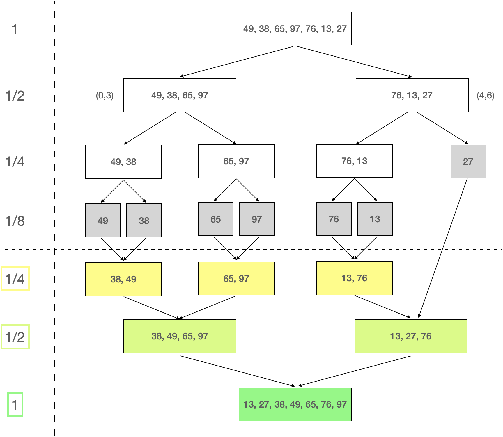

[TOC]

现在设想有两个已排序的数据项集合，如何将它们合成一个有序集合？
一个解决方案是先将它们连接成一个大数组，然后使用之前的冒泡、选择、插入、快速等排序方法对其进行排序。
如果采用选择排序或插入排序，则适用的数据集就不能太大。而且，没有充分利用两个集合已经有序这一初始条件。

## wiki

[Merge sort](https://en.wikipedia.org/wiki/Merge_sort)

Merge sort is a divide-and-conquer algorithm that was invented by John von Neumann in 1945.
A detailed description and analysis of bottom-up merge sort appeared in a report by Goldstine and von Neumann as early as 1948.

Conceptually, a merge sort works as follows:

1. Divide the unsorted list into n sublists, each containing one element (a list of one element is considered sorted).
2. Repeatedly merge sublists to produce new sorted sublists until there is only one sublist remaining. This will be the sorted list.

### impl

主要有 Top-down 和 Bottom-up 两种实现方式：

1. Top-down implementation
2. Top-down implementation using lists: 参考 Python 实现 merge_sort_recur
3. Bottom-up implementation
4. Bottom-up implementation using lists: 参考 Python 实现 merge_sort_stack

## geeks

[Merge Sort](https://www.geeksforgeeks.org/merge-sort/)

Merge sort is defined as a sorting algorithm that works by dividing an array into smaller subarrays, sorting each subarray, and then merging the sorted subarrays back together to form the final sorted array.

In simple terms, we can say that the process of merge sort is to divide the array into two halves, sort each half, and then merge the sorted halves back together. This process is repeated until the entire array is sorted.

### Need

Need for Merge Sort

One thing that you might wonder is what is the specialty of this algorithm. We already have a number of sorting algorithms then why do we need this algorithm? One of the main advantages of merge sort is that it has a time complexity of $O(nlogn)$, which means it can sort large arrays relatively quickly. It is also a stable sort, which means that the order of elements with equal values is preserved during the sort.

## 二路归并

考虑两个有序数组：a1[5]={1,5,6,9,10}; a2[5]={2,3,4,7,8};  

假设有两个游标p1和p2，初始分别指向a1和a2开头：p1=&a1[0], p2=&a2[0]。
分配一个数组 a[10]，size(a)=size(a1)+size(a2)，用于容纳排序结果。

1. 比较p1和p2，取其中较小的放入a，并将游标后移。
2. 重复1，直到p1或p2指向数组末尾，即其中一个数组耗尽。
3. 如果p1或p2其中一个尚未指向结尾，则将剩余的元素逐个追加到a。

详细的二路归并（mergeSortedArrays）流程如下：

- round 1: *p1 < *p2, a.append(p1) = {1}, p1++;
- round 2: *p2 < *p1, a.append(p2) = {1,2}, p2++;
- round 3: *p2 < *p1, a.append(p2) = {1,2,3}, p2++;
- round 4: *p2 < *p1, a.append(p2) = {1,2,3,4}, p2++;
- round 5: *p1 < *p2, a.append(p1) = {1,2,3,4,5}, p1++;
- round 6: *p1 < *p2, a.append(p1) = {1,2,3,4,5,6}, p1++;
- round 7: *p2 < *p1, a.append(p2) = {1,2,3,4,5,6,7}, p2++;
- round 8: *p2 < *p1, a.append(p2) = {1,2,3,4,5,6,7,8}, p2++ 越界;
- round 9: a1剩余两个元素，继续遍历p1，将剩余元素追加到a={1,2,3,4,5,6,7,8,9,10}，归并完成。

## 直接归并

以上二路归并，输入的是两个有序数组。
但是，日常需求更多的是对一个无序序列进行排序。
直接的思路是先将原始无序序列一分为二，对两路排好序再归并。
对分出的其中一路(1/2)，当然可以使用之前学习过的排序算法。
但是，如果中途分路使用其他算法，那么一开始就采用可能更合理。

沿着上面的思路，可以对两路1/2各自继续划分成四个1/4，两个1/4继续划分成1/8，...。
直到其中一路或两路元素个数为1，不可再分割。单元素自然有序，两路即可开始归并。
假设分裂到第三层，两个1/8路元素个数为1，即可将两个1/8归并成1/4。

1. 如果另外1/4包含多个元素，则分裂成两个1/8再归并回1/4，再与另1/4继续归并成1/2。
2. 如果另外1/4落单，即只包含一个元素，即可直接开始将两个1/4归并成1/2。

接下来，对两路1/2进行归并，合龙成最终有序序列。

## 案例演绎

考虑 A[7]={49, 38, 65, 97, 76, 13, 27}

计算中点 mid=(0+7)/2=3，left=A[0:3]={49,38,65,97}，right=A[4:7]={76,13,27}

1. 对左1/2继续分裂，mid=(0+3)/2=1，left=A[0:1]={49,38}，right=A[2:3]={65,97}

1.1 对左1/4继续分裂，mid=(0+1)/2=0，left=A[0:0]={49}，right=A[1:1]={38}

- 将左1/4分裂出来的两路1/8进行归并 {38,49}

1.2 对右1/4继续分裂，mid=(2+3)/2=2，left=A[2:2]={65}，right=A[3:3]={97}

- 将右1/4分裂出来的两路1/8进行归并 {65,97}

1.3 对左1/2分裂出来的两路已归并的1/4进行归并 {38,49,65,97}

2. 对右1/2继续分裂，mid=(4+7)/2=5，left=A[4:5]={76,13}，right=A[6:6]={27}，这里右1/4落单。

2.1 对左1/4继续分裂，mid=(4+5)/2=4，left=A[4:4]={76}，right=A[5:5]={13}

- 将左1/4分裂出来的两路1/8进行归并 {13,76}

2.2 对右1/2分裂出来的两路1/4进行归并 {13,27,76}

3. 对左右两路1/2进行归并，得到最终有序结果序列：{13,27,38,49,65,76,97}。

归并排序的递归基是抵达单元素最小有序序列，返回单元素自身。
然后，两路单元素归并合龙，不断对原路分裂的“两路”进行归并，最终合龙成一路。

