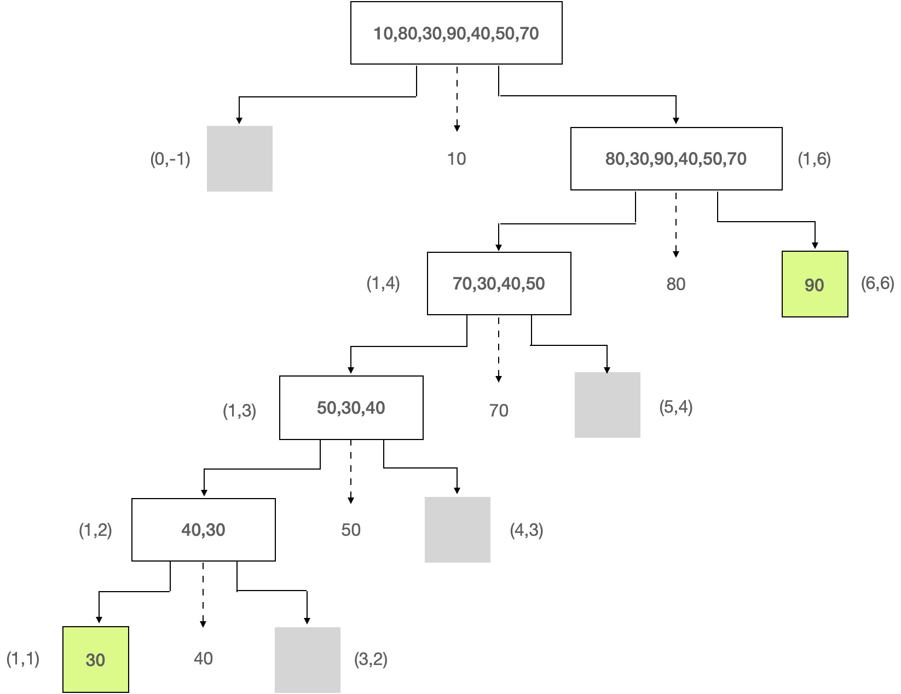
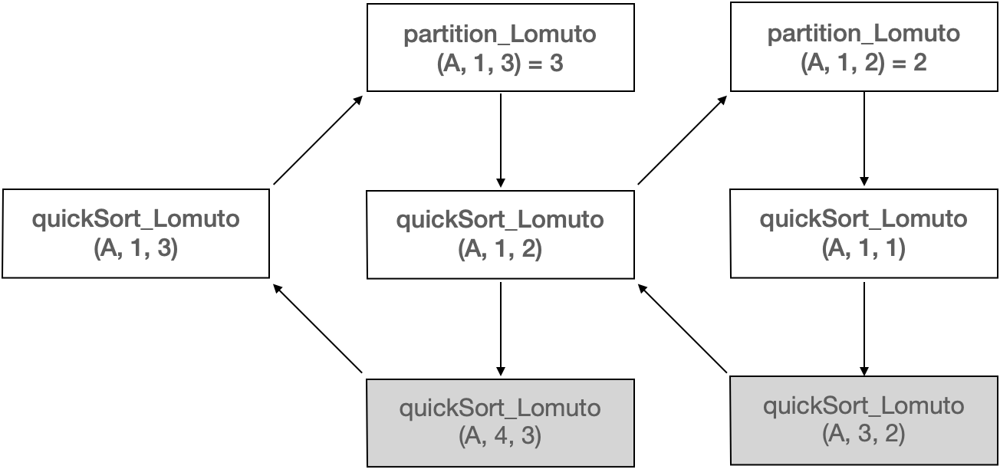

[TOC]

## Lomuto partition scheme

wiki - [QuickSort](https://en.wikipedia.org/wiki/Quicksort)

Lomuto's partition scheme was also popularized by the textbook `Introduction to Algorithms` although it is inferior to Hoare's scheme because it does three times more swaps on average and degrades to `$O(n^2)$` runtime when all elements are equal.

---

This scheme is attributed to Nico Lomuto and popularized by Bentley in his book `Programming Pearls` and Cormen et al. in their book `Introduction to Algorithms`.

In most formulations this scheme chooses as the pivot the **last** element in the array. The algorithm maintains index `i` as it scans the array using another index `j` such that the elements at `lo` through `i-1` (inclusive) are less than the pivot, and the elements at `i` through `j` (inclusive) are equal to or greater than the pivot. As this scheme is more compact and easy to understand, it is frequently used in introductory material, although it is less efficient than Hoare's original scheme e.g., when all elements are equal.

Lomuto 分治策略的核心思想：通过遍历将相对枢轴的小值都移动聚拢到左边，然后将枢轴移动到小值右侧（大值左侧），完成一趟分治。

每一趟分治，伴随着小值的筛检和枢轴的归位，以枢轴作为参考基准，完成一次大的切割分治：

```
[比基准值小的数] 基准值 [比基准值大的数]
```

由于 `[左边的小值]<基准值<[右边的大值]`，先不考虑小值分区和大值分区内部的顺序，这三部分整体在最终有序序列中即是这个排布顺序。

继续对左右分区实施同样的切割分治策略，直到所有的原子分区都排好序，归总起来就是最终的有序序列。

相比原始 Hoare 策略，Lomuto 分治策略相对容易理解，采用单边循环法即可实现。

- geeksforgeeks [QuickSort](https://www.geeksforgeeks.org/quick-sort/) 中的例程流程分析即采用的是 Lomuto 分治策略。

### 算法流程

**初始条件**：

待排数组 A[N]，索引范围 low=0, high=N-1；

#### 流程描述

1. 选定最后一个元素作为基准：pivot = A[p] = A[high]
2. 初始化循环变量 j=low，对应索引取值范围 [low,high-1]；初始化最右小值索引 i=low-1。

    - 初始 j=0, i=-1（初始虚设小值位置在遍历的首元素之前，下一个小值为++i=0）。

3. 从左到右循环遍历 j ∈ [low,high-1]，判断支点左侧的值 A[j]<pivot：

    - 如果不满足条件，则维持不变；
    - 否则，执行 swap(A[j], A[++i])，将最新小值 A[j] 交换移动到上一次小值右边，这样 A[i] 变成新的最右小值。

4. 当遍历循环结束时，所有的小值都已经聚拢到左侧，索引i指向当前最右小值（小于基准元素的区域边界）。执行 swap(A[p], A[i+1]) 使 pivot 归位，这样 pivot 左边都是小值，pivot 右边都是大值，完成一趟分治。

    - 本轮分治结果是 `[:i], pivot, [i+2:]`，左右相对基准有序，局部尚需继续分治排序。

index    |  [:i]  |  i+1  | [i+2:]
---------|--------|-------|--------
division | [小值] | pivot | [大值]

5. 以 pivot index 为支点，将源序列切割成左分区 [:i] 和右分区 [i+2:]，再分别对子分区递归执行分治流程（1~4）。

    - 传入参数即是递归调用所需的初始化条件: (subarray, low, high)

#### 边界条件

1. 遍历过程中：

    - 如果j=i+1，即小值A[j]已在其位，可判断不交换

2. 遍历结束后：

    - 如果i=low，for循环未找到小值，即pivot最小，交换到最左边
    - 如果i=high，for循环前面的都是小值，即pivot最大，已经在右边，可判断不交换

#### 首元素作为基准

在上述算法中，变量i记录当前最右小值索引，每次更换都要先i++，理解起来不是那么直观。

1. 选定第一个元素作为基准：pivot = A[p] = A[low]
2. 初始化循环变量 j=low+1，对应索引取值范围 [low+1,high]；初始化最右小值索引 i=low。

    - 初始 j=1, i=0（初始虚设小值位置为枢轴自身）。

3. 从左到右循环遍历 j ∈ [low+1,high]，判断支点左侧的值 A[j]<pivot：

    - 如果不满足条件，则维持不变；
    - 否则，执行 swap(A[j], A[++i])，将最新小值 A[j] 交换移动到上一次小值右边，这样 A[i] 变成新的最右小值。

> swap(A[j], A[++i]): （1）++i 将小值游标后移；（2）swap(A[j], A[i])。

后续步骤基本相同，区别是最后的pivot归位：

- 在将末尾元素作为基准时，最终将pivot交换归位到最右小值右边（++i）。
- 而将首元素作为基准时，最终将pivot与最右小值交换，使得pivot“居中”。

#### 递归调用结束条件

对于递归调用，在第1步之前，需检测递归基（base case）作为终止条件，以保障算法的有穷性。
当检测到分区为空（size=0）或只有一个元素（size=1）时，无法再切割，即为递归基，递归退出。
当所有的子分区的递归分治都抵达base case时，伴随着分治过程中的比较和就地交换，逐步消除逆序，排序完成。

### 案例演绎

Lomuto 单边循环流程分析

**初始条件**：

A[7] = {10, 80, 30, 90, 40, 50, 70}

0  | 1  | 2  | 3  | 4  | 5  | 6
---|----|----|----|----|----|----
10 | 80 | 30 | 90 | 40 | 50 | 70

1. 选定最后一个元素作为基准：pivot = A[p] = A[high] = 70
2. 初始化循环变量 j=low=0，对应索引取值范围 [low, high]（[0-5]）；初始化最右小值索引 i=low-1=-1。

**一趟分割流程演绎**：

j=0: 由于 A[j]<pivot，故swap(A[j], A[++i])->swap(A[0], A[0])，即i=0为当前最右小值索引。

- 相同索引不用交换

j=1: 由于 A[j]>pivot，保持不变。
j=2: 由于 A[j]<pivot，故swap(A[j], A[++i])->swap(A[2],A[1])，当前最右小值索引变成i=1，如下表所示。

0  | 1  | 2  | 3  | 4  | 5  | 6
---|----|----|----|----|----|----
10 | *30* | *80* | 90 | 40 | 50 | 70

j=3: 由于 A[j]>pivot，保持不变。

j=4: 由于 A[j]<pivot，故swap(A[j], A[++i])->swap(A[4],A[2])，当前最右小值索引变成i=2，如下表所示。

0  | 1  | 2  | 3  | 4  | 5  | 6
---|----|----|----|----|----|----
10 | 30 | *40* | 90 | *80* | 50 | 70

j=5: 由于 A[j]<pivot，故swap(A[j], A[++i])->swap(A[5],A[3])，当前最右小值索引变成i=3，如下表所示。

0  | 1  | 2  | 3  | 4  | 5  | 6
---|----|----|----|----|----|----
10 | 30 | 40 | *50* | 80 | *90* | 70

由于 j>=high-1，j 循环结束，执行 swap(A[p], A[++i]) 即 swap(A[6], A[4])，pivot归位，完成本轮分治。

0  | 1  | 2  | 3  | 4  | 5  | 6
---|----|----|----|----|----|----
10 | 30 | 40 | 50 | **70** | 90 | 80

**二趟分割 1.left 流程演绎**：左分区 [0:3]=[10,30,40,50], pivot=A[3]=50

- 初始化：循环变量 j=low=0，最右小值索引 i=low-1=-1。

j=0: 由于 A[j]<pivot，故 swap(A[j], A[++i])->swap(A[0], A[0])，相同索引不用交换，即i=0为当前最右小值索引。

j=1: 由于 A[j]<pivot，故 swap(A[j], A[++i])->swap(A[1], A[1])，相同索引不用交换，即i=1为当前最右小值索引。

j=2: 由于 A[j]<pivot，故 swap(A[j], A[++i])->swap(A[2], A[2])，相同索引不用交换，即i=2为当前最右小值索引。

由于 j>=high-1，j 循环结束，执行 swap(A[p], A[++i]) 即 swap(A[3], A[3])，相同索引不用交换，完成本轮分治。

- 实际上，人眼视觉能够马上识别出本分组已经就序，本轮循环没有发生实质交换。因为相对最右侧的基准值而言，左侧的三个值都小于它，即所有小值已经在基准左侧，由于基准值本身最大，故没有比它更大的值，右侧为空，已然分治。
- 当然，计算机无法马上识别出本分组已经就序，从程序和代码设计的一致性角度考虑，上述流程依旧会执行。不过，swap  内部实现可以优化，针对相同索引（值）不做真正交换。
- 接下来，继续划分 `[10,30,40], 50, []`，需要继续对左分区进行分治排序。由于已然有序，这里省略展示。

**二趟分割 1.right 流程演绎**：右分区 [5:6]=[90,80], pivot=A[6]=80

- 初始化：循环变量 j=low=5，最右小值索引 i=low-1=4。

j=5: 由于 A[j]>pivot，保持不变。

由于 j>=high-1，j 循环结束，执行 swap(A[p], A[++i]) 即 swap(A[6], A[5])，完成本轮分治 `[], 80, [90]`。

 5  | 6  
----|----
 80 | 90 

左分区只有一个元素（size=1）不可再分割，右分区为空（size=0）不可再分割。

---

由于 Lomuto 分治策略也是 In-place Swap 的，故所有分区最终分割到 base case（分区为空或只有一个元素）无法再分割时，即整体结束合体时，原始数组即已交换排好序。

将二趟分割还原到一趟分割，由分到合最后排好的序列如下：

0  | 1  | 2  | 3  | 4  | 5  | 6
---|----|----|----|----|----|----
10 | 30 | 40 | 50 | **70** | 80 | 90

## 代码实现

基于递归的分治算法，主体由三部分构成：

1. base case: recursion terminator

    - base case 1: 只有一个元素: low=high
    - base case 2: pivot居两端: high<low，居左左空(low,low-1)，居右右空(high+1,high)

2. partition: in-place compare and swap

    - return pivot position

3. recursion for sub-arrays splitted by pivot

    - left small part: [low, p-1]
    - right big part: [p+1, high]

```C
// 对子数组 A[l:h] 进行快速排序，返回pivot分治索引
void quickSort_Lomuto(int *array, const int low, const int high) {
    // base case 1: 只有一个元素: low=high
    // base case 2: pivot居两端: high<low，居左左空(low,low-1)，居右右空(high+1,high)
    if (low >= high)
        return;
    // in-place compare and swap
    int pivot_index = partition_Lomuto(array, low, high);
    // recursion for left small part
    quickSort_Lomuto(array, low, pivot_index-1);
    // recursion for right big part
    quickSort_Lomuto(array, pivot_index+1, high);
}
```

可以将递归比喻成烟花（尽管比喻不太确切），初始调用 `quickSort_Lomuto(A, 0, len(A)-1)` 就是点燃烟花的引子。

1. 刚开始对A围绕pivot（首元素或尾元素）进行Lomuto分治完成一次粗排，将小值摆在pivot左边，将大值摆在pivot右边，返回pivot索引。
2. 然后，再对pivot两侧的分区递归调用Lomuto分治，生成新的左右分区。继续递归分治，左侧分区分裂到底，触及base case递归才返回。

   - base case：分区大小为0或1。

3. 当第1层左分区分治完毕，右分区开始分治。待右分区分治完毕，则整体合龙，完成排序。

    - 递归一直在纵向深入嵌套调用（压栈），直到裂变触底才会一层一层返回（出栈）。
    - 每次调用partition后，先左后右递归，完成左分区的分治，才开始着手右分区。

---

**注意**：Python 中 list 切片返回的是原数据的副本，如果 qsort_Lomuto 中传切片副本 A[:p]、A[p+1:]，需要返回拼接！

### 分治流程

以下是对 A[7] = {10, 80, 30, 90, 40, 50, 70} 执行partition_Lomuto(PivotPosition.Head)分治的递归裂变图。

1. 虚线箭头指向的是每轮的 pivot。
2. 灰色背景指向的pivot居两端时，一侧的空分区（low>high），base case。
3. 绿色背景指向的是被枢轴切割到只剩下一个元素的情况（low=high），base case。



结合 Python 运行日志，对比查看以上流程图：

```
A[0:6]=[10, 80, 30, 90, 40, 50, 70], pivot=Head
homing pivot=0, [],10,[80, 30, 90, 40, 50, 70]
A[1:6]=[80, 30, 90, 40, 50, 70], pivot=Head
homing pivot=5, [70, 30, 40, 50],80,[90]
A[1:4]=[70, 30, 40, 50], pivot=Head
homing pivot=4, [50, 30, 40],70,[]
A[1:3]=[50, 30, 40], pivot=Head
homing pivot=3, [40, 30],50,[]
A[1:2]=[40, 30], pivot=Head
homing pivot=2, [30],40,[]
```

### 递归调用

我们再回过头来看看A[1:3]=[50, 30, 40]时，quickSort_Lomuto两层嵌套调用的压栈、出栈机制流程。

```
quickSort_Lomuto(A, 1, 3)
{
    int pivot_index = partition_Lomuto(A, 1, 3);
}
```

partition_Lomuto 返回的结果是 homing pivot=3，实际经过partition内部交换，A[1:3]=[40, 30, 50]。

继续调用 `quickSort_Lomuto(A, 1, 2)` 对分区 [40,30] 进行分治。

```
quickSort_Lomuto(A, 1, 3)
{
    int pivot_index = partition_Lomuto(A, 1, 3) = 3
    quickSort_Lomuto(A, 1, 2);
}
```

`quickSort_Lomuto(A, 1, 2)` 调用展开如下：

```
quickSort_Lomuto(A, 1, 2) {
    int pivot_index = partition_Lomuto(A, 1, 2) = 2
    quickSort_Lomuto(A, 1, 1); // 单元素，返回
    quickSort_Lomuto(A, 3, 2); // 右空，返回
}
```

返回结果是 homing pivot=2，经过partition内部交换，A[1:2]=[30, 40]。

返回到上一步，左分治结束，继续分治右分区，右分区为空，分治结束。

```
quickSort_Lomuto(A, 1, 3)
{
    int pivot_index = partition_Lomuto(A, 1, 3) = 3
    quickSort_Lomuto(A, 1, 2); // 返回 [30,40]
    quickSort_Lomuto(A, 4, 3); // 右空，返回
}
```

至此，A[1,2] 已排好序，A[3] 为pivot，A[1:3] 整体排好了。


