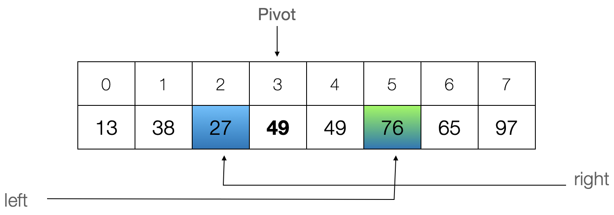
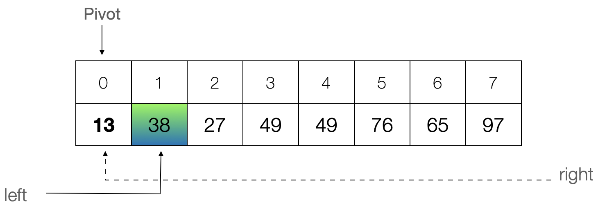
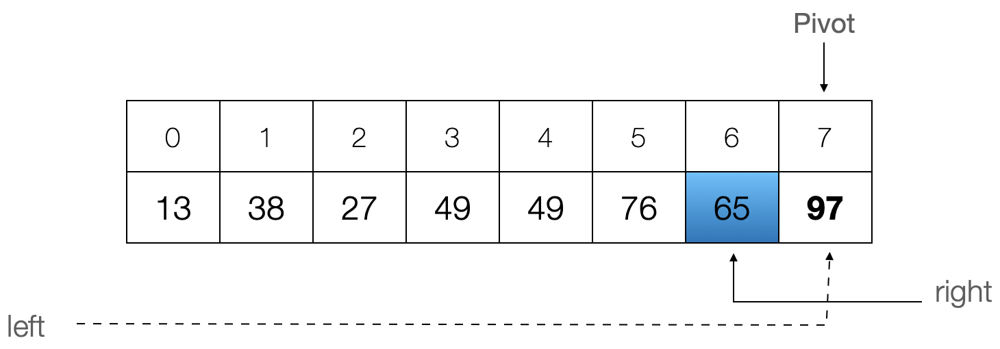
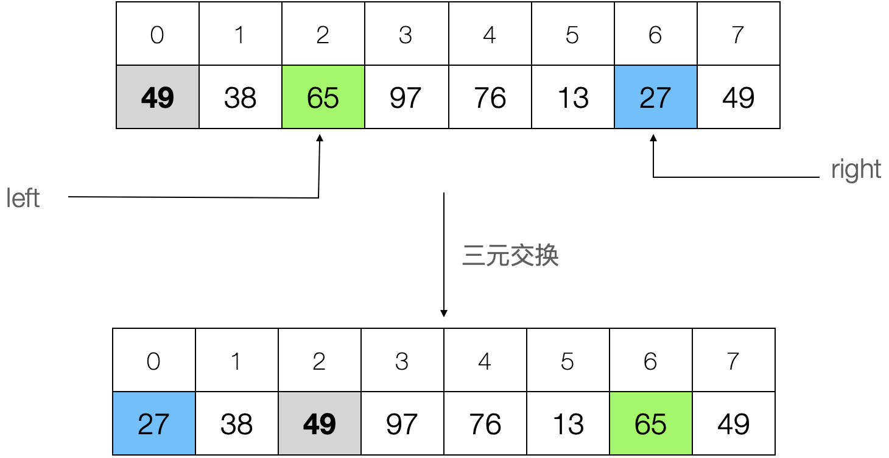
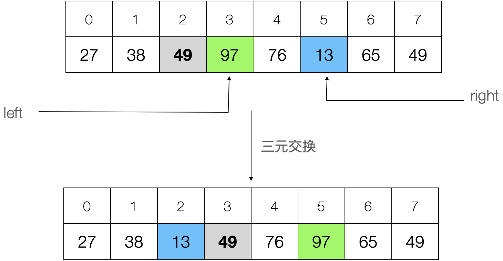
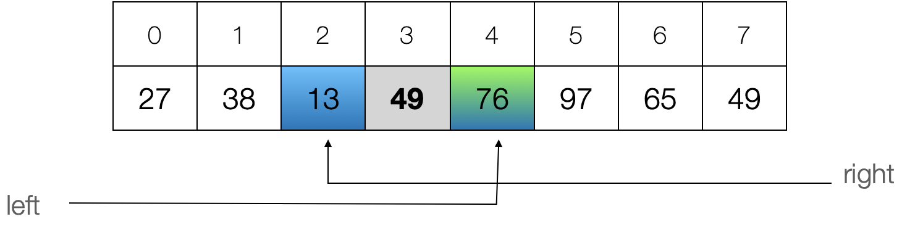

[TOC]

在 Lomuto 分治策略中，通过遍历将相对枢轴的小值都移动聚拢到左侧，然后将枢轴移动到小值右侧（大值左侧），完成一趟分治。

在 Hoare 原始算法流程中，每次通过双边循环找到一对逆序对（右小值和左大值索引）进行交换，直到所有逆序对都交换完毕，最后将 pivot 与最右小值交换归位，完成一趟分治。

本文中摇摆策略中，通过单边双向交换构造围绕基准的有序三元组。重复局部三元交换，直到不再存在相对 pivot 的逆序三元组，完成一趟分治。

- 每次的“三元交换”涉及两次交换：swap(small, pivot), swap(big, pivot)。

## 严蔚敏-左右摇摆

严蔚敏-《数据结构(C语言版）（第2版）》

该分治策略采用的是单边双向摇摆，有点类似鸡尾酒冒泡排序。

通过单边双向摇摆，将小值交换到左边、大值交换到右边，从而生成以pivot为轴心的局部有序（升序）三元组：small<pivot<big。即三元组通过左右两次交换，完成一次局部排序。

三元局部排序后，pivot被移动到新的（索引）位置。以新的pivot索引作为支点，重复这种双向比较交换，直到将所有的小值都移动到pivot左边、所有的大值都移动到pivot右边，完成一趟分治：`[小值],pivot,[大值]`。

### 算法流程1

**初始条件**：

待排数组 A[N]，索引下界 low=0, 上界 high=N-1；

#### 流程描述

1. 初始选定第一个元素作为枢轴（基准、支点）：pivot = A[p] = A[low]；

    - 枢轴索引位置p动态更新，但是 pivot 值始终不变（A[p]），按这个参考值进行切割分治。

2. 从右向左(索引范围：right=[high, low])，找到第一个关键字小于枢轴关键字 pivotkey 的记录，将其与当前枢轴记录交换，即 swap(A[r], A[p])。

    - 如果 right>p，即小值在枢轴右边，位置逆序才需交换，并更新pivot索引p=right

3. 再从左向右(索引范围：left=[low, high])，找到第一个关键字大于枢轴关键字 pivotkey 的记录，将其与当前枢轴记录交换，即 swap(A[l], A[p])。

    - 如果 left<p，即大值在枢轴左边，位置逆序才需交换，并更新pivot索引p=left

4. 重复步骤2和3，直至 left 与 right 相等或交叉为止（right<=left）。 此时 p 为枢轴在此趟排序中的最终位置，且左右两部分相对基准就序，完成一趟分治。

    - 本轮分治结果是 `[:p-1], pivot, [p+1:]`，左右相对基准有序，分区尚需继续分治排序。

index    | [:p-1] |   p   | [p+1:]
---------|--------|-------|--------
division | [小值] | pivot | [大值]

5. 以 pivot index 为支点，将源序列切割成左分区 [:p-1] 和右分区 [p+1:]，再分别对子分区递归执行分治流程（1~4）。

- 传入参数即是递归调用所需的初始化条件: (subarray, low, high)

---

对于pivot=A[p]，如果满足 A[b]>pivot 和  A[s]<pivot，那么b和s相对p逆序：

   p  |  b  |  s
------|-----|------
pivot | big | small

通过步骤2和3，将小值交换到左边、大值交换到右边，从而生成以pivot为轴心的局部有序（升序）三元组：s<p<b && small<pivot<big。

   s  |   p   |  b
------|-------|------
small | pivot | big

重复以上步骤将所有的小值都移动到pivot左边，将所有大值都移动到pivot右边，则完成一趟分治。

然后，再对左、右子分区递归分治，即可完成整体排序。

#### 一趟分治结束条件

初始选定第一个元素作为枢轴（基准、支点）：pivot = A[p] = A[low]；

如果两侧或某一侧相对pivot乱序：

1. 先从右向左找到小值，且满足逆序条件（p<right 但 A[p]>A[right]），执行交换 swap(A[p], A[right])，p=right。

2. 再从左向右搜索大值，可能有三种情况：

    - 2.1 在p(right)左侧找到大值（left<p(right)），执行交换 swap(A[p], A[left])，p=left。两步整体相当于将pivot交换到中间，小值交换到左、大值交换到右。
    - 2.2 越过p(right)找到大值（left>right），说明大值都已在右（左边都是小值），结束本轮分治；
    - 2.3 甚至抵达最右侧索引边界high（left=high>right）还是没找到大值，说明pivot本身最大，结束本轮分治。

如果两侧相对pivot已有序：

1. 初始选定第一个元素作为枢轴，若pivot本身最小，从右向左查找小值时，right抵达p(low)也未找到，此时right=p(low)。左侧小值分区为空，右侧已是大值，本轮分治提前结束。

2. 中途枢轴位置更新，若从右向左找到小值时，right穿越到pivot左边，即right<p；从左向右找到大值时，left穿越到pivot右边，即p<left。此时，right<p<left 且 A[right]<A[p]<A[left]，意味着右边不存在小值，左边不存在大值，即相对pivot已然有序。

3. 从左向右搜索大值，见2.2和2.3。

综上所述，可以将游标 cross over （!(left<right) 或 right<=left） 作为一趟分治的结束条件。

- 意味着单边双向摇摆后，围绕pivot不存在逆序对，一趟分治完成。

---

A={13, 38, 27, 49, 49, 76, 65, 97}

1. 选定 pivot=A[3]=49，那么从右往左第一个小值=A[2]=27，从左往右第一个大值是A[5]=76。左边最后一个小值已经在pivot左边，右边第一个大值已经在pivot右边，意味着整体相对基准已经有序，本轮分治完成。



1. 特殊地，选定 pivot=A[0]=13，那么从右往左未找到小值，right=low；从左往右第一个即是大值 A[1]=38。左边没有小值（pivot最小），右边第一个大值已经在pivot右边，意味着整体相对基准已经有序，本轮分治完成。



3. 特殊地，选定 pivot=A[7]=97，那么从右往左第一个即是小值，A[6]=65；从左往右未找到大值，left=high。右边没有大值（pivot最大），左边第一个小值已经在pivot左边，意味着整体相对基准已经有序，本轮分治完成。



#### 递归调用结束条件

算法主体和 Lomuto 一致，仅仅是分区策略（partition）不同。
因此，递归调用结束条件，同 Lomuto 分治策略保持一致。

#### 案例演绎

**初始条件**：

A[8] = {49,38,65,97,76,13,27,49}

0  | 1  | 2  | 3  | 4  | 5  | 6  | 7
---|----|----|----|----|----|----|----
49 | 38 | 65 | 97 | 76 | 13 | 27 | 49

1. 选定第一个元素作为基准：pivot = A[p] = A[0] = 49；
2. 初始化索引下界 low=0, 上界 high=N-1；

**一趟分割流程演绎**：

1. 从右high=7向左找到小值 A[right]=A[6]，执行交换 swap(A[r], A[p])->swap(A[6], A[0]) 消除逆序，更新 pivot_index=6。

0  | 1  | 2  | 3  | 4  | 5  | 6  | 7
---|----|----|----|----|----|----|----
**27** | 38 | 65 | 97 | 76 | 13 | **49** | 49

2. 从左low=0向右找到大值 A[left]=A[2]，执行交换 swap(A[l], A[p])->swap(A[2], A[6]) 消除逆序，更新 pivot_index=2。

0  | 1  | 2  | 3  | 4  | 5  | 6  | 7
---|----|----|----|----|----|----|----
27 | 38 | **49** | 97 | 76 | 13 | **65** | 49

通过以上两步交换，得到围绕pivot的有序三元组：A[0]<A[p=2]<A[6]（27<49<65）



重复1、2，得到围绕pivot的新有序三元组：A[2]<A[p=3]<A[5]（13<49<97）

0  | 1  | 2  | 3  | 4  | 5  | 6  | 7
---|----|----|----|----|----|----|----
27 | 38 | 13 | **49** | 76 | 97 | 65 | 49



重复1、2，得到 right=2，left=4，右指针cross左指针（right<left），本趟分割结束：`[27,38,13], 49, [76,97,65,49]`



**二趟分割 1.left 流程演绎**：A[0:2]=[27,38,13]，pivot=A[0]=27

1. 从右high=2向左找到小值 A[right]=A[2]，执行交换 swap(A[r], A[p])->swap(A[2], A[0]) 消除逆序，更新 pivot_index=2。
2. 从左low=0向右找到大值 A[left]=A[1]，执行交换 swap(A[l], A[p])->swap(A[1], A[2]) 消除逆序，更新 pivot_index=1。

0  | 1  | 2  
---|----|----
13 | **27** | 38 

重复1、2，右指针right抵达最小索引未找到小值，左指针left抵达最大索引未找到大值。右指针cross左指针（right<left），本趟分割结束：`[13], 27, [38]`。

- 由于左分区和右分区都只有一个元素（size=1），故无法再切割分治。

**二趟分割 1.right 流程演绎**：A[4:7]=[76,97,65,49]，pivot=A[4]=76

1. 从右high=7向左找到小值 A[right]=A[7]，执行交换 swap(A[r], A[p])->swap(A[7], A[0]) 消除逆序，更新 pivot_index=7。
2. 从左low=4向右找到大值 A[left]=A[5]，执行交换 swap(A[l], A[p])->swap(A[5], A[7]) 消除逆序，更新 pivot_index=5。

4  | 5  | 6  | 7 
---|----|----|----
49 | 76 | 65 | 97 

3. 从右high=7向左找到小值 A[right]=A[6]，执行交换 swap(A[r], A[p])->swap(A[6], A[5]) 消除逆序，更新 pivot_index=6。

4  | 5  | 6  | 7 
---|----|----|----
49 | 65 | 76 | 97 

4. 从左low=4向右找到大值 A[left]=A[7]。右指针cross左指针（right<left），本趟分割结束：`[49,65], 76, [97]`。

- 右分区只有一个元素，无法再切割分治；左分区需要继续分治。

**三趟分割 2.left 流程演绎**：A[4:5]=[49,65]，pivot=A[4]=49

1. 从右high=5向左，right抵达最小索引low=4未找到小值。
2. 从左low=4向右找到大值 A[left]=A[5]。右指针cross左指针（right<left），本趟分割结束：`[], 49, [65]`。

- 左分区为空，右分区只有一个元素，无法再切割分治。

---

由于该分治策略也是 In-place Swap 的，故所有分区最终分割到 base case（分区为空或只有一个元素）无法再分割时，即整体结束合体时，原始数组即已交换排好序。

将二趟分割 1.left 和 二趟分割 1.right 还原到一趟分割由分到合的最终排序结果序列如下：

0  | 1  | 2  | 3  | 4  | 5  | 6  | 7
---|----|----|----|----|----|----|----
13 | 27 | 38 | **49** | 49 | 65 | 76 | 97

### 算法流程2

上述流程1是初学时，为了理解上的方便，曲解了教科书的原始步骤流程，每两次交换组成有序三元。
在所有的小值、大值没有都分拣到左、右两边之前，pivot的位置一直是动态更新的。
伴随着最后一次围绕pivot交换消除逆序，pivot位置即是终极位置。

对于pivot=A[p]，如果满足 A[p]<A[left] && A[p]>A[right]，那么left和right相对p逆序：

   p  | left | right
------|------|------
pivot | big  | small

流程1中的两步交换（swap(right, p), swap(left, p)），本质上需要完成的消除相对逆序，因此可以精简优化。

```
# 初始支点位置，并备份pivot值（本轮固定）
p = low = 0
pivot = A[p]
# 初始化左右游标
l = low
r = high
# 右、左摇摆消除逆序对
while (l<r) { # 至少两个元素
    r = high        # 复位右游标，每次都是从最右向左扫描
    # 从右向左比较，找到第一个小值A[r]
    if (r > p)      # 右侧小值
        A[p] = A[r] # 将右侧小值移到最左侧支点位置
        p = r       # 暂存支点最新位置

    l = low         # 复位左游标，每次都是从最左向右扫描
    # 从左向右比较，找到第一个大值A[r]
    if (l < p)      # 左侧大值
        A[r] = A[l] # 将左侧大值移到最右侧小值位置
        p = l       # 暂存支点最新位置

    if (l >= r)     # 本轮分治结束，将pivot归位
        A[p] = pivot
        // break; // 退出 while循环
    # else: 继续while循环寻找下一逆序对
}
```

通过以上步骤，将小值交换到左边、大值交换到右边，从而消除一对逆序。

 o_p  | o_l | o_r
------|-----|------
small |     | big

以上摇摆过程中将交换（三条赋值）优化为一条赋值，只是记录更新pivot最新位置。
每一轮左右摇摆结束，如果大值在右、小值在左（l>r），表明不再存在逆序对。
特殊的，如果序列整体倒序，左侧pivot最大，右侧都是小值：

1. 右向左：r=high，第一个即是小值，A[p]=A[r]，更新p=r；
2. 左向右：抵达尽头都没找到大值，l=high=r。此时，pivot尚需归位。

因此，在满足退出条件（l>=r）退出之前，需要将pivot复位：A[p]=pivot。

以上算法流程，关键思路和 Hoare 原始算法基本是一致的，但是由于每次都覆盖了原始pivot位置，需要动态记录新的pivot位置。
按照教科书上的描述，每次都要复位游标从一侧末端开始扫描，其实可以和 Hoare 一样不必复位游标，继续从上一次的游标位置向中间压缩推进。
因为第一轮将右边的第一个小值和左边的第一个大值交换后，第二轮再扫描，右边的小值必然在之前小值位置左边，左边的大值必然在之前大值右边。

这样改进后，Cocktail 和 Hoare 算法差异不大：

1. Hoare 分治策略是先找到左右逆序对索引，再 swap 交换，right指向最右小值；
2. Cocktail 是单边摇摆，两次赋值变相完成一次交换，更新记录pivot位置；
3. 最终将 pivot 交换/赋值到支点所属位置，完成归位。

## 代码实现

基于递归的分治算法，主体由三部分构成：

1. base case: recursion terminator

    - base case 1: overlap: low=high，只有一个元素
    - base case 2: cross: high<low，左空(0,-1)，右空(h+1, h)

2. partition: in-place compare and swap

    - return pivot position

3. recursion for sub-arrays splitted by pivot

    - left small part: [low, p-1]
    - right big part: [p+1, high]

quickSort_Cocktail 和 quickSort_Lomuto、quickSort_Hoare 的主体结构完全一样，区别在于 partition 分治实现。

```C
// 对子数组 A[l:h] 进行快速排序，返回pivot分治索引
void quickSort_Cocktail(int *array, const int low, const int high) {
    // base case 1: overlap: low=high，只有一个元素
    // base case 2: cross: high<low，左空(0,-1)，右空(h+1, h)
    if (low >= high)
        return;
    // in-place compare and swap
    int pivot_index = partition_Cocktail(array, low, high);
    // recursion for left small part
    quickSort_Cocktail(array, low, pivot_index-1);
    // recursion for right big part
    quickSort_Cocktail(array, pivot_index+1, high);
}
```

**注意**：Python 中 list 切片返回的是原数据的副本，如果 qsort_Lomuto 中传切片副本 A[:p]、A[p+1:]，需要返回拼接！
